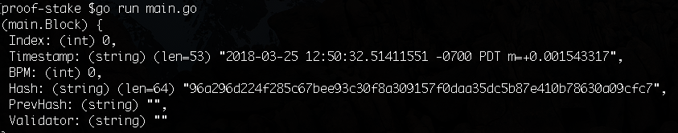
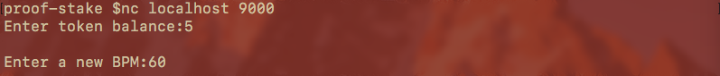
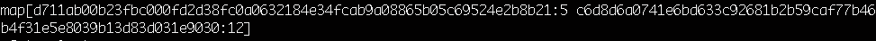
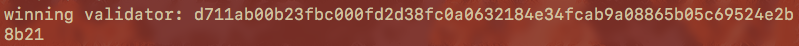
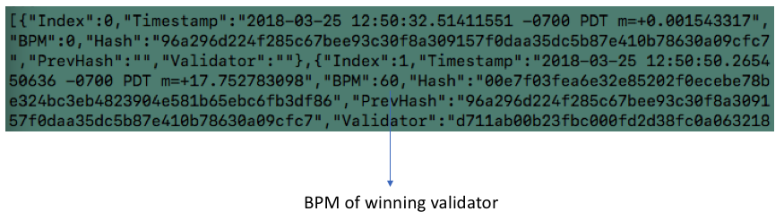

# GO代码实现的PoS算法

注意：
- P2P网络的实现。文中的网络是模拟的，区块链状态只在其中一个中心化节点持有，而不是每个节点，同时状态通过该持有节点广播到其它节点
- 钱包和余额变动。本文没有实现一个钱包，持有的令牌数量是通过stdin（标准输入)输入的，你可以输入你想要的任何数量。一个完整的实现会为每个节点分配一个hash地址，并在节点中跟踪余额的变动

### 架构图

！[](images/1.png)

- 我们将有一个中心化的TCP服务节点，其他节点可以连接该服务器
- 最新的区块链状态将定期广播到每个节点
- 每个节点都能提议建立新的区块
- 基于每个节点的令牌数量，其中一个节点将随机地(以令牌数作为加权值)作为获胜者，并且将该区块添加到区块链中

### 设置和导入

```go
package main

import (
	"crypto/sha256"
	"encoding/hex"
	"encoding/json"
	"fmt"
	"io"
	"log"
	"net/http"
	"os"
	"strconv"
	"strings"
	"sync"
	"time"

	"github.com/davecgh/go-spew/spew"
	"github.com/gorilla/mux"
)
```
- spew 可以把我们的区块链用漂亮的格式打印到终端terminal中

### 快速脉搏检查

假设我们是一家医疗保健公司，目前要去收集人体脉搏信息，同时添加到我们的区块上。把两个手指放在你的手腕上，数一下你一分钟能感觉到多少次脉搏，这将是您的BPM整数，我们将在接下来的文章中使用。

### 全局变量

```go
var Blockchain []Block	// 主区块链
var tempBlocks []Block	// 临时存放区块单元

// Block的通道，任何一个节点在提出一个新块时都将它发送到这个通道
var candidateBlocks = make(chan Block)

// 是一个通道，我们的主Go TCP服务器将向所有节点广播最新的区块链
var announcements = make(chan string)

// 控制读写和防数据竞争的标准变量
var mutex = &sync.Mutex{}

// 节点的存储map，同时也会保存每个节点持有的Token数
// key:地址 ; value:token 数
var validators = make(map[string]int)
```

- Block是每个区块的内容
- Blockchain是我们的主区块链，它只是一串经过验证的区块集合。每个区块中的PrevHash与前面块的Hash相比较，以确保我们的链是正确的。
- tempBlocks是临时存储单元，在区块被选出来并添加到BlockChain之前，临时存储在这里
- candidateBlocks是Block的通道，任何一个节点在提出一个新块时都将它发送到这个通道
- announcements也是一个通道，我们的主Go TCP服务器将向所有节点广播最新的区块链
- mutex是一个标准变量，允许我们控制读/写和防止数据竞争
- validators是节点的存储map，同时也会保存每个节点持有的令牌数

### 基本的区块链函数

在继续PoS算法之前，我们先来实现标准的区块链函数。

```go
// SHA256哈希
// calculateHash 是一个简单的计算SHA256的哈希函数
func calculateHash(s string) string {
	h := sha256.New()
	h.Write([]byte(s))
	hashed := h.Sum(nil)
	return hex.EncodeToString(hashed)
}

// calculateBlockHash 返回所有的block信息
func calculateBlockHash(block Block) string {
	record := string(block.Index) + block.Timestamp + string(block.BPM) + block.PrevHash
	return calculateHash(record)
}
```
这里先从hash函数开始，calculateHash函数会接受一个string，并且返回一个SHA256 hash。calculateBlockHash是对一个block进行hash，将一个block的所有字段连接到一起后，再进行hash。
```go
// 创建新的块
func generateBlock(oldBlock Block, BPM int, address string) (Block, error) {
	var newBlock Block
	t := time.Now()
	newBlock.Index = oldBlock.Index + 1
	newBlock.Timestamp = t.String()
	newBlock.BPM = BPM
	newBlock.PrevHash = oldBlock.Hash
	newBlock.Hash = calculateBlockHash(newBlock)
	newBlock.Validator = address
	return newBlock, nil
}
```
generateBlock是用来创建新块的。每个新块都有的一个重要字段是它的hash签名(通过calculateBlockHash计算的)和上一个连接块的PrevHash(因此我们可以保持链的完整性)。我们还添加了一个Validator字段，这样我们就知道了该构建块的获胜节点。
```go
// isBlockValid 是通过检查索引并比较前一个块的散列来确保块有效
func isBlockValid(newBlock, oldBlock Block) bool {
	if oldBlock.Index + 1 != newBlock.Index {
		return false
	}
	if oldBlock.Hash != newBlock.PrevHash {
		return false
	}
	if calculateBlockHash(newBlock) != newBlock.Hash {
		return false
	}
	return true
}
```
isBlockValid会验证Block的当前hash和PrevHash，来确保我们的区块链不会被污染。

### 节点（验证者)

当一个验证者连接到我们的TCP服务，我们需要提供一些函数达到以下目标：

- 输入令牌的余额（之前提到过，我们不做钱包等逻辑)
- 接收区块链的最新广播
- 接收验证者赢得区块的广播信息
- 将自身节点添加到全局的验证者列表中（validators)
- 输入Block的BPM数据- BPM是每个验证者的人体脉搏值
- 提议创建一个新的区块

这些目标，我们用handleConn函数来实现

```go
// 处理TCP的连接
func handleConn(conn net.Conn) {
	defer conn.Close()

	go func() {
		for {
			msg := <-announcements
			io.WriteString(conn, msg)
		}
	}()
	var address string	// 验证器的地址

	// 允许用户分配一定数量的权益tokena
	// tokens的数量越多, 生成新块的机会就越多
	io.WriteString(conn, "Enter token balance:")
	scanBalance := bufio.NewScanner(conn)
	for scanBalance.Scan() {
		balance, err := strconv.Atoi(scanBalance.Text())
		if err != nil {
			log.Printf("%v not a number: %v", scanBalance.Text(), err)
			return
		}
		t := time.Now()
		address = calculateHash(t.String())
		validators[address] = balance
		fmt.Println(validators)
		break
	}

	io.WriteString(conn, "\nEnter a new BPM:")

	scanBPM := bufio.NewScanner(conn)

	go func() {
		for {
			// 在进行必要的验证后，从stdin输入BPM 并将其添加到区块链
			for scanBPM.Scan() {
				bpm, err := strconv.Atoi(scanBPM.Text())
				
				// 如果验证者试图提议一个被污染（例如伪造）的block，例如包含一个不是整数的BPM，
				// 那么程序会抛出一个错误，我们会立即从我们的验证器列表validators中删除该验证者，
				// 他们将不再有资格参与到新块的铸造过程同时丢失相应的抵押令牌。
				if err != nil {
					log.Printf("%v not a number: %v", scanBPM.Text(), err)
					delete(validators, address)
					conn.Close()
				}

				mutex.Lock()
				oldLastIndex := Blockchain[len(Blockchain)-1]
				mutex.Unlock()

				// 我们用generateBlock函数创建一个新的block，
				// 然后将其发送到candidateBlocks通道进行进一步处理
				newBlock, err := generateBlock(oldLastIndex, bpm, address)
				if err != nil {
					log.Println(err)
					continue
				}
				if isBlockValid(newBlock, oldLastIndex) {
					candidateBlocks <- newBlock
				}
				io.WriteString(conn, "\nEnter a new BPM:")
			}
		}
	}()

	// 模拟接收广播
	for {
		time.Sleep(15*time.Second)

		io.WriteString(conn, "\n")
		mutex.Lock()
		spew.Fdump(conn, Blockchain)
		mutex.Unlock()
		io.WriteString(conn, "\n")
	}
}
```

第一个Go协程接收并打印出来自TCP服务器的任何通知，这些通知包含了获胜验证者的通知。

`io.WriteString(conn, “Enter token balance:”)`允许验证者输入他持有的令牌数量，然后，该验证者被分配一个SHA256地址，随后该验证者地址和验证者的令牌数被添加到验证者列表validators中。

接着我们输入BPM，验证者的脉搏值，并创建一个单独的Go协程来处理这块儿逻辑，下面这一行代码很重要:
`delete(validators, address)`

如果验证者试图提议一个被污染（例如伪造）的block，例如包含一个不是整数的BPM，那么程序会抛出一个错误，我们会立即从我们的验证器列表validators中删除该验证者，他们将不再有资格参与到新块的铸造过程同时丢失相应的抵押令牌。

正式因为这种抵押令牌的机制，使得PoS协议是一种更加可靠的机制。如果一个人试图伪造和破坏，那么他将被抓住，并且失去所有抵押和未来的权益，因此对于恶意者来说，是非常大的威慑。

接着，我们用generateBlock函数创建一个新的block，然后将其发送到candidateBlocks通道进行进一步处理。将Block发送到通道使用的语法:
`candidateBlocks <- newBlock`

上面代码中最后一段的循环会周期性的打印出最新的区块链，这样每个验证者都能获知最新的状态

### 选择获胜者

这里是PoS的主题逻辑。我们需要编写代码以实现获胜验证者的选择;他们所持有的令牌数量越高，他们就越有可能被选为胜利者。

为了简化代码，我们只会让提出新块儿的验证者参与竞争。在传统的PoS，一个验证者即使没有提出一个新的区块，也可以被选为胜利者。切记，PoS不是一种确定的定义（算法)，而是一种概念，因此对于不同的平台来说，可以有不同的PoS实现。

下面来看看pickWinner函数：
```go
// 选择获胜者
// pickWinner创建一个验证器的抽奖池，并通过从池中随机选择块来选择验证者来伪造一个区块链，
// 并通过标记的数量加权
func pickWinner() {
	time.Sleep(30 * time.Second)
	mutex.Lock()
	temp := tempBlocks
	mutex.Unlock()

	lotteryPool := []string{}	// 抽奖池
	if len(temp) > 0 {

		// 稍微修改了所有提交块的验证者的传统权益证明算法，通过传统证据中的放样令牌数加权，
		// 验证者可以参与，而无需提交要伪造的块
	OUTER:
		for _, block := range temp {
			// 如果已经在抽奖池中，跳过
			for _, node := range lotteryPool {
				if block.Validator == node {
					continue OUTER
				}
			}

			// 锁定验证者从而避免数据竞赛
			mutex.Lock()
			setValidators := validators
			mutex.Unlock()

			// 如果有k个token,我们就用k个元素填充抽奖池
			k, ok := setValidators[block.Validator]
			if ok {
				for i := 0; i < k; i++ {
					lotteryPool = append(lotteryPool, block.Validator)
				}
			}
		}

		// 随机从抽奖池中选择一个胜利者
		s := rand.NewSource(time.Now().Unix())
		r := rand.New(s)
		lotteryWinner := lotteryPool[r.Intn(len(lotteryPool))]

		// 添加区块链优胜者区块并让所有其他节点知道
		for _, block := range temp {
			if block.Validator == lotteryWinner {
				mutex.Lock()
				Blockchain = append(Blockchain, block)
				mutex.Unlock()
				for _ = range validators {
					announcements <- "\nwinning validator: " + lotteryWinner + "\n"
				}
				break
			}
		}
	}

	mutex.Lock()
	tempBlocks = []Block{}
	mutex.Unlock()
}
```

每隔30秒，我们选出一个胜利者，这样对于每个验证者来说，都有时间提议新的区块，参与到竞争中来。接着创建一个`lotteryPool`，它会持有所有验证者的地址，这些验证者都有机会成为一个胜利者。然后，对于提议块的暂存区域，我们会通过 `if len(temp) > 0` 来判断是否已经有了被提议的区块。

在 `OUTER FOR` 循环中，要检查暂存区域是否和lotteryPool中存在同样的验证者，如果存在，则跳过。

在以 `k, ok := setValidators[block.Validator]` 开始的代码块中，我们确保了从temp中取出来的验证者都是合法的，即这些验证者在验证者列表validators已存在。若合法，则把该验证者加入到lotteryPool中。

那么我们怎么根据这些验证者持有的令牌数来给予他们合适的随机权重呢？

首先，用验证者的令牌填充lotteryPool数组，例如一个验证者有100个令牌，那么在lotteryPool中就将有100个元素填充；如果有1个令牌，那么将仅填充1个元素。

然后，从lotteryPool中随机选择一个元素，元素所属的验证者即是胜利者，把胜利验证者的地址赋值给lotteryWinner。这里能够看出来，如果验证者持有的令牌越多，那么他在数组中的元素也越多，他获胜的概率就越大；同时，持有令牌很少的验证者，也是有概率获胜的。

接着我们把获胜者的区块添加到整条区块链上，然后通知所有节点关于胜利者的消息：`announcements <- "\nwinning validator: " + lotteryWinner + "\n"`。

最后，清空tempBlocks，以便下次提议的进行。

以上便是PoS一致性算法的核心内容，该算法简单、明了、公正，所以很酷！

### main函数

下面我们把之前的内容通过代码都串联起来

```
func main() {
	// 创建创世区块
	t := time.Now()
	genesisBlock := Block{}
	genesisBlock = Block{0, t.String(), 0, calculateBlockHash(genesisBlock), "", ""}
	spew.Dump(genesisBlock)
	Blockchain = append(Blockchain, genesisBlock)

	// 开启TCP服务器
	server, err := net.Listen("tcp", ":8080")
	if err != nil {
		log.Fatal(err)
	}
	defer server.Close()

	go func() {
		for candidate := range candidateBlocks {
			mutex.Lock()
			tempBlocks = append(tempBlocks, candidate)
			mutex.Unlock()
		}
	}()

	go func() {
		for {
			pickWinner()
		}
	}()

	for {
		conn, err := server.Accept()
		if err != nil {
			log.Fatal(err)
		}
		go handleConn(conn)
	}
}
```

这里从.env文件开始，然后创建一个创世区块`genesisBlock`，形成了区块链。接着启动了Tcp服务，等待所有验证者的连接。

启动了一个Go协程从`candidateBlocks`通道中获取提议的区块，然后填充到临时缓冲区`tempBlocks`中，最后启动了另外一个Go协程来完成`pickWinner`函数。

最后面的for循环，用来接收验证者节点的连接。

###结果

下面来运行程序，打开一个终端窗口，通过go run main.go来启动整个TCP程序，如我们所料，首先创建了创始区块`genesisBlock`。



接着，我们启动并连接一个验证者。打开一个新的终端窗口，通过linux命令 `nc localhost 8080` 来连接到之前的TCP服务。然后在命令提示符后输入一个持有的令牌数额，最后再输入一个验证者的脉搏速率BPM。



然后观察第一个窗口（主程序)，可以看到验证者被分配了地址，而且每次有新的验证者加入时，都会打印所有的验证者列表



稍等片刻，检查下你的新窗口（验证者)，可以看到正在发生的事：我们的程序在花费时间选择胜利者，然后Boom一声，一个胜利者就诞生了！



再稍等一下，boom! 我们看到新的区块链被广播给所有的验证者窗口，包含了胜利者的区块和他的BPM信息。很酷吧！



参考：

- https://medium.com/@mycoralhealth/code-your-own-proof-of-stake-blockchain-in-go-610cd99aa658
- http://chaingod.io/article/16