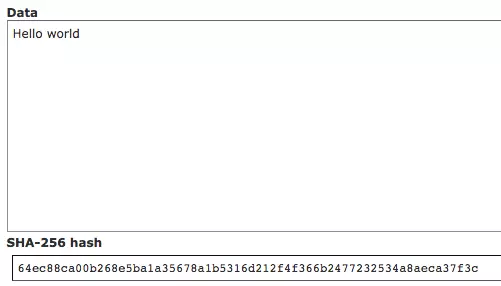

# GO代码实现的PoW挖矿算法

转载文章
https://mp.weixin.qq.com/s/Nf7qg1nWaFYsO6x-yVyzxg

在本系列前两篇文章中[[1]](../blockchain/README.md) [[2]](../networking/README.md)，我们向大家展示了如何通过精炼的Go代码实现一个简单的区块链。包括生成块，验证块数据，广播通信等等，这一篇让我们聚焦在如何实现 PoW算法。

大家都无不惊呼比特币、以太坊及其他加密电子货币的持续狂热，特别是对于刚接触这个领域的新手，不断得听到张三李四通过 GPU “挖矿”而聚集价值数万乃至数百万加密电子货币。那么“挖矿”到底是什么？ 它是如何工作的？ 相信对于程序员来说，没有什么比自己动手实践一遍“挖矿”算法更好的学习办法了。

在这篇文章中，让我们一起逐个解读每一个问题，并最终编写出自己的“挖矿”算法。这个算法称为工作证明算法（Proof-of-Work），它是比特币和以太坊这两种最流行的加密货币的基础。


## 什么是“挖矿”？

加密电子货币因为稀缺才具有价值。以现在的比特币为例，如果任何人任何时候都可以随意“制造”比特币，那么作为电子货币它会变得毫无价值。比特币通过算法来控制产出的速率并在大约122年内达到最大量。这种随着时间推移缓慢、稳定并逐步产出的方式有效避免了通货膨胀。

比特币的产出是通过给予“获胜矿工”奖励来实现，为了获取比特币奖励矿工之间会进行竞争。这个过程之所以被称为“挖矿”，是因为它类似于“Gold Rush”时每个黄金矿工通过辛苦劳作并最终（希望）找到一点黄金。


## “挖矿”是如何工作的？

如果 Google 一下这个问题，你会得到大量的结果。简单来说，“挖矿”就是“解决一个数学难题”的过程。我们先来了解一些密码学和哈希算法的知识。

### 密码学简要介绍

单向加密以人类可读的文本（明文）作为输入，比如“Hello world”这个字符串，再通过一个数学函数产生出难以辨认的输出（密文）。 这类函数或算法的性质和复杂性各不相同。 算法越复杂，逆向工程就越困难。 

以流行的 SHA-256 算法为例。 通过这个网站可以让你计算任意给定输入的输出，也就是 SHA-256 哈希值。比如让我们输入“Hello world”，看看得到了什么：




通过不断尝试计算“Hello world”的哈希值。你会发现每次的结果都完全相同。 这个过程称为幂等性。

加密算法一个最基本的特性是，非常难以通过反向工程来求解输入，但是非常容易验证输出。比如上面的例子，你可以很容易验证给定输入“Hello world”的SHA-256哈希值是否正确，但很难通过给定的哈希值判断它的输入是什么。这就是为什么将这种类型的算法称为单向加密。

比特币使用 Double SHA-256，它将 SHA-256 求得的哈希值作为输入再次计算 SHA-256 哈希值。 为了简化，我们只使用一次SHA-256。

### 挖矿

回到加密电子货币中，比特币就是通过让参与者利用这样的加密算法求解出符合特定条件的哈希值来实现“挖矿”过程。具体来说，比特币要求参与者通过 double SHA-256 算法计算出“前导0”超过若干位的哈希值，第一个求解出来的参与者就是“获胜的矿工”。

比如，我们求“886”这个字符串的 SHA-256 哈希值：


可以看到，是一个“前导0”为3位的哈希值（前三位是0）。

回忆我们前面说到的“单向加密”的特点：

任何人都可以很容易地验证“886”是否产生3位“前导0”的哈希值。但为了找到这样一个能产生3位“前导0”的输入（就是这里的“886”），我们做了大量繁琐的计算工作：从一个很大的数字和字母集合中逐个计算它们的哈希值并判断是否满足上述条件。如果我是第一个找到“886”的人，那其他人通过验证就能判断我做了这样大量繁琐的工作。在比特币、以太坊中这样的过程就称为工作证明算法。

“如果我运气非常好，第一次尝试就找到了一个符合条件的（输入）值呢？” —— 这是非常不可能的，你可以试试随意输入一些字母和数字。

比特币中实际的算法和约束要比上说要求复杂，当然也更难（要求更多位的“前导0”）。同时它也可以动态调整难度，目标是确保每隔10分钟产出一次比特币，不管参与“挖矿”的人多还是少。

差不多可以动手了

了解了足够的背景知识，接着我们就用 Go 语言来编码实践下工作量证明（Proof-of-Work）算法。

建议你阅读之前的系列文章 [[1]](../blockchain/README.md) [[2]](../networking/README.md)，因为下面工作证明算法部分会涉及之前的代码。

### Proof-of-work

创建新块并加入到链上之前需要完成“工作量证明”过程。我们先写一个简单的函数来检查给定的哈希值是否满足要求。
- 哈希值必须具有给定位的“前导0”
- “前导0”的位数是由难度（difficulty）决定的
- 可以动态调整难度（difficulty）来确保 Proof-of-Work 更难解
下面就是 isHashValid 这个函数：

```go
func isHashValid(hash string, difficulty int) bool {
        prefix := strings.Repeat("0", difficulty)
        return strings.HasPrefix(hash, prefix)
}
```

Go 语言的 strings 包中提供了方便的 Repeat 和 HasPrefix 函数。我们定 prefix 变量，它代表“前导0”，接着检查哈希值是否具有满足条件的“前导0”，然后返回 True 或 False 。

我们修改之前生成块的generateBlock 函数：

```go
func generateBlock(oldBlock Block, BPM int) Block {
        var newBlock Block

        t := time.Now()

        newBlock.Index = oldBlock.Index + 1
        newBlock.Timestamp = t.String()
        newBlock.BPM = BPM
        newBlock.PrevHash = oldBlock.Hash
        newBlock.Difficulty = difficulty

        for i := 0; ; i++ {
                hex := fmt.Sprintf("%x", i)
                newBlock.Nonce = hex
                if !isHashValid(calculateHash(newBlock), newBlock.Difficulty) {
                        fmt.Println(calculateHash(newBlock), " do more work!")
                        time.Sleep(time.Second)
                        continue
                } else {
                        fmt.Println(calculateHash(newBlock), " work done!")
                        newBlock.Hash = calculateHash(newBlock)
                        break
                }

        }
        return newBlock
}
```

创建一个新块 newBlock ，里面的 PrevHash 包含前一个块的哈希值，Timestamp 是时间戳，BPM 是心率数据，Difficulty 就是前面提到的难度，它的值决定了“前导0”的位数。

这里的 for 循环很重要：

获得 i 的十六进制表示 ，将 Nonce 设置为这个值，并传入 calculateHash 计算哈希值。之后通过上面的 isHashValid 函数判断是否满足难度要求，如果不满足就重复尝试。
这个计算过程会一直持续，知道求得了满足要求的 Nonce 值，之后通过 handleWriteBlock 函数将新块加入到链上。

## 跑起来看看

启动程序：
```
go run main.go
```

在浏览器中访问 http://localhost:8080


接着通过 Postman 来发送一个包含心率数据的POST 请求。


接着我们观察命令行窗口，不断得计算哈希值，如果不满足难度要求就继续重试，直到找到满足要求的哈希值及 Nonce


可以看到最后一个哈希值满足我们设定的难度要求（1位“前导0”）。我们再来刷新下浏览器：


可以看到第二个块创建成功并加到链上了，其中Nonce 就是通过Proof-of-Work计算出来满足难度要求的值。


下一步

到这里要先祝贺你，上面的内容很有价值。尽管我们的示例中使用了非常低的难度，但本质上，工作证明算法就是比特币、以太坊等区块链的重要组成。

对于下一步应该深入区块链的哪个方向，我们推荐可以学习如何通过 IPFS 存取大文件并与区块链打通。

此外相比 Proof-of-Work，Proof-of-Stake 算法正越来越受到关注和青睐，你也可以学习如何将本文的 PoW 算法改为实现 PoS 算法。

参考链接

[1] [只用200行Go代码写一个自己的区块链！](main1.md)
[2] [200行Go代码实现自己的区块链——区块生成与网络通信](main2.md)
[3] https://en.bitcoin.it/wiki/Proof_of_work
[4] https://zh.wikipedia.org/zh-cn/%E6%B7%98%E9%87%91%E6%BD%AE
[5] http://www.xorbin.com/tools/sha256-hash-calculator
[6] https://github.com/mycoralhealth/blockchain-tutorial/blob/master/proof-work/main.go
[7] https://github.com/ipfs/ipfs
[8] https://en.bitcoin.it/wiki/Proof_of_Stake

